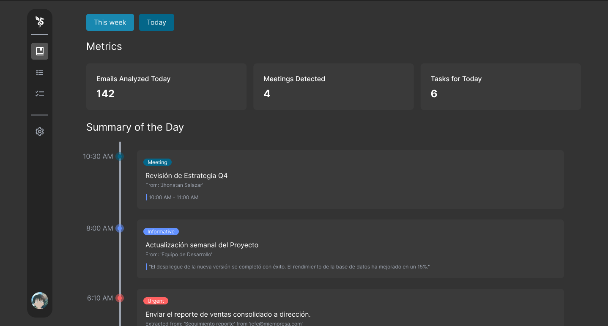

  

<h1 align="center">Amaru – AI Email Agent</h1>

  <strong>Language:</strong> 
  <a href="README.md">🇬🇧 English</a> | 
  <a href="./docs/es/README.es.md">🇪🇸 Español</a>

  <strong>Amaru</strong> is an intelligent email assistant inspired by the Andean mythological serpent. It optimizes inbox management using AI, integrating with Gmail and Google Calendar to automate tasks and improve productivity.

---

## 📌 Overview

Amaru helps users manage their inbox efficiently by:

- Reading emails and classifying them into categories
- Suggesting actions that users can confirm, modify, or ignore
- Providing an intuitive dashboard for quick review

  

## 🔑 Key Features

- Secure Gmail connection via **OAuth 2.0**
- Email reading and storage in **PostgreSQL**
- Automatic classification into categories:
  - Meetings
  - Newsletters
  - Spam
  - General
  - And much more...
- Minimal automatic actions:
  - Create calendar events
  - Archive irrelevant emails
- Dashboard for reviewing and confirming suggested actions

## 🛠 Technologies

| Layer            | Tech Stack                 |
| ---------------- | -------------------------- |
| Frontend/Backend | Next.js + TypeScript       |
| UI               | Tailwind CSS + Shadcn UI   |
| Database         | PostgreSQL (ACID + JSONB)  |
| Authentication   | OAuth 2.0 with Better Auth |
| Task Queues      | BullMQ                     |
| Containers       | Docker & Docker Compose    |
| CI/CD            | GitHub Actions             |
